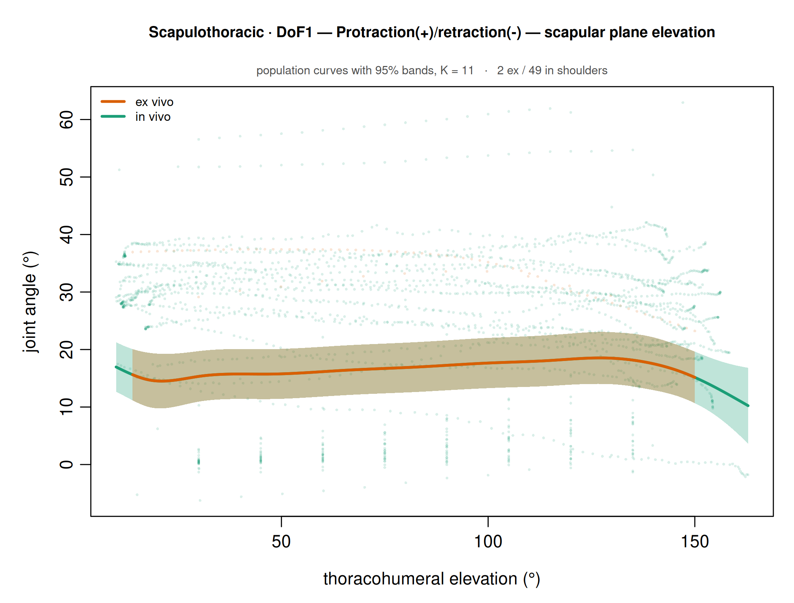
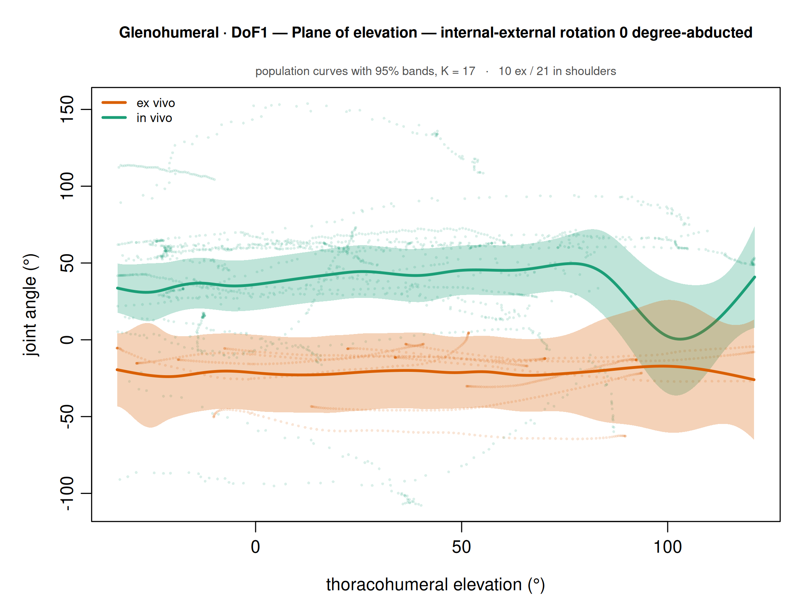

# Sweep v3 — état d'avancement des fittings

Inférence de l'[itération 06](../06_natural_spline_hlme/) appliquée aux 72 cellules
articulation × mouvement × DoF. Figures par cellule dans `cells/<cellule>/` (`01_choosing_k` … `06_diagnostics`).

```
1  K par BIC sur le modèle RÉDUIT (sans condition), K = 1..20,
   ajusté sur la condition de RÉFÉRENCE seule.  Partie aléatoire = K.
1a RMSE par épaule, flag robuste, R2 marginal vs sujet-spécifique.
2  modèle complet au MÊME K, toutes les épaules, in vivo en référence.
3  LR = 2(LL1 - LL0) ~ chi2(K+1), Bonferroni sur toutes les cellules comparées.
4  pas de Wald — la courbe de différence est l'objet rapporté.
```

## Bilan

| cellules | 72 |
| --- | ---: |
| comparées | 33 — **23 significatives** (Bonferroni), 10 ns |
| une seule condition | 30 |
| écartées | 9 |

## Questions en suspens — à trancher avant d'aller plus loin

- **Q1 — Sur quelles données choisir K ?** (OBS2, OBS5)
  Sur la condition qui a le plus d'épaules, ou sur la plus petite pour ne pas overshoot ? Et faut-il limiter K au nombre d'épaules ?
- **Q2 — Enveloppes de CI qui ressemblent à des artefacts de spline** (OBS4)
  Les garder, ou réduire la complexité du modèle ?
- **Q3 — GH, IER0, DoF1/DoF3 : relation plutôt linéaire à l'œil**
  Limiter à deux effets aléatoires et modéliser une droite ?

## Observations

- **OBS1 — Non-convergence quand il y a peu d'in vivo** (eg. deux épaules). La convergence échoue pour certains K : parfois pour tous les K au-delà d'un seuil, parfois pour des K intermédiaires.
  - AC, DoF1, frontal : 10/20 K convergés, K_retenu = 8, 4 épaules in vivo / 10 ex vivo.
  - AC, DoF1, IER0 : K_retenu = 16, K = 10, 11, 12, 17, 18 n'ont pas convergé.
- **OBS2 — « N random variances from M shoulders — K is not identifiable here »**. Quand K+1 ≥ nombre d'épaules, le modèle doit estimer plus de variances aléatoires (une par colonne de spline) qu'il n'y a d'épaules pour les estimer : chaque épaule suit sa propre courbe et le BIC, pénalisé sur le nombre de sujets donc peu coûteux, continue de descendre (eg. AC, DoF1, horizontal flexion, K_retenu = 19, 20 variances pour 9 épaules). Le K retenu décrit alors la flexibilité donnée à chaque épaule, pas la forme de la trajectoire moyenne. → Q1
- **OBS3 — Cellules à une seule condition** (ex vivo seul ou in vivo seul). Le fitting ne porte que sur une catégorie : ok pour donner le corridor sur la planche, mais pas de comparaison in vivo / ex vivo possible.
- **OBS4 — Enveloppes de CI qui ressemblent à des artefacts de fitting de spline.** → Q2
- **OBS5 — Trop peu d'une condition** (eg. 1–2 ex vivo face à beaucoup d'in vivo) : l'enveloppe de la courbe ex vivo est la même que celle de l'in vivo, la condition ne se démarque pas. Hypothèse : K a été identifié sur l'in vivo (jusqu'à 49 épaules). → Q1

  

## État par articulation × mouvement

AC acromioclaviculaire · GH glénohuméral · ST scapulothoracique · SC sternoclaviculaire.
Effectifs en épaules in vivo / ex vivo (identiques pour les 3 DoF). Comparée si ≥ 3 épaules dans chaque condition ; écartée si < 4 épaules au total.


For ex


F


fzzdzdzdzzzzzzzzzzzzzzzzzzzzzzdzdzdzdzdzddzeeeeee                       

⚠ AC frontal apparaît deux fois dans les notes : une fois OBS2, une fois « tout est ok » (à préciser).

**Note GH, IER0** — assez de données, le fitting aléatoire marche. Mais l'angle thoracohuméral n'est pas le meilleur prédicteur : certains points reviennent en arrière (y augmente ou diminue pendant que x oscille). Élément de discussion pour le papier.



## Annexe — cellules comparées, plus grand |Δ| moyen en premier

| joint | motion | DoF | K | shoulders ex/in | mean \|Δ\| | LR | df | p | Bonferroni | |
| --- | --- | ---: | ---: | ---: | ---: | ---: | ---: | ---: | ---: | --- |
| Glenohumeral | internal-external rotation 0 degree-abducted | 3 | 17 | 10/21 | 66.8° | 24.5 | 18 | 1.4e-01 | 1.0e+00 | ns |
| Glenohumeral | frontal plane elevation | 3 | 9 | 10/23 | 58.0° | 46.4 | 10 | 1.2e-06 | 4.0e-05 | *** |
| Glenohumeral | internal-external rotation 0 degree-abducted | 1 | 17 | 10/21 | 56.6° | 34.4 | 18 | 1.1e-02 | 3.7e-01 | ns |
| Glenohumeral | sagittal plane elevation | 3 | 9 | 10/24 | 54.9° | 416.7 | 10 | 2.6e-83 | 8.7e-82 | *** |
| Acromioclavicular | sagittal plane elevation | 2 | 11 | 10/3 | 20.8° | 299.6 | 12 | 5.6e-57 | 1.9e-55 | *** |
| Acromioclavicular | frontal plane elevation | 2 | 3 | 10/4 | 19.9° | 34.5 | 4 | 5.9e-07 | 1.9e-05 | *** |
| Scapulothoracic | horizontal flexion | 2 | 9 | 10/7 | 19.7° | 104.1 | 10 | 8.0e-18 | 2.7e-16 | *** |
| Glenohumeral | internal-external rotation 0 degree-abducted | 2 | 10 | 10/21 | 19.6° | 48.2 | 11 | 1.3e-06 | 4.3e-05 | *** |
| Glenohumeral | sagittal plane elevation | 1 | 9 | 10/24 | 18.8° | 406.4 | 10 | 4.2e-81 | 1.4e-79 | *** |
| Sternoclavicular | frontal plane elevation | 3 | 11 | 13/4 | 13.0° | 179.8 | 12 | 4.7e-32 | 1.6e-30 | *** |
| Scapulothoracic | horizontal flexion | 3 | 8 | 10/7 | 12.4° | 25.2 | 9 | 2.8e-03 | 9.1e-02 | ns |
| Sternoclavicular | sagittal plane elevation | 3 | 8 | 13/3 | 11.9° | 96.1 | 9 | 9.4e-17 | 3.1e-15 | *** |
| Scapulothoracic | horizontal flexion | 1 | 9 | 10/7 | 11.8° | 135.6 | 10 | 3.3e-24 | 1.1e-22 | *** |
| Acromioclavicular | frontal plane elevation | 3 | 9 | 10/4 | 10.8° | 23.2 | 10 | 1.0e-02 | 3.3e-01 | ns |
| Scapulothoracic | frontal plane elevation | 2 | 10 | 13/31 | 10.1° | 105.0 | 11 | 1.8e-17 | 6.0e-16 | *** |
| Glenohumeral | frontal plane elevation | 2 | 10 | 10/23 | 9.8° | 122.0 | 11 | 7.1e-21 | 2.3e-19 | *** |
| Scapulothoracic | internal-external rotation 0 degree-abducted | 2 | 15 | 10/21 | 9.6° | 30.0 | 16 | 1.8e-02 | 5.9e-01 | ns |
| Glenohumeral | frontal plane elevation | 1 | 9 | 10/23 | 9.4° | 42.2 | 10 | 6.9e-06 | 2.3e-04 | *** |
| Scapulothoracic | sagittal plane elevation | 2 | 9 | 13/25 | 9.1° | 119.1 | 10 | 7.7e-21 | 2.5e-19 | *** |
| Scapulothoracic | internal-external rotation 0 degree-abducted | 1 | 11 | 10/21 | 7.6° | 175.1 | 12 | 4.3e-31 | 1.4e-29 | *** |
| Glenohumeral | sagittal plane elevation | 2 | 13 | 10/24 | 7.4° | 385.9 | 14 | 1.2e-73 | 3.8e-72 | *** |
| Acromioclavicular | sagittal plane elevation | 1 | 8 | 10/3 | 7.2° | 29.5 | 9 | 5.4e-04 | 1.8e-02 | * |
| Scapulothoracic | sagittal plane elevation | 1 | 11 | 13/25 | 7.0° | 39.4 | 12 | 8.9e-05 | 2.9e-03 | ** |
| Scapulothoracic | frontal plane elevation | 3 | 10 | 13/31 | 7.0° | 63.0 | 11 | 2.6e-09 | 8.5e-08 | *** |
| Scapulothoracic | frontal plane elevation | 1 | 11 | 13/31 | 6.7° | 16.6 | 12 | 1.6e-01 | 1.0e+00 | ns |
| Sternoclavicular | sagittal plane elevation | 2 | 8 | 13/3 | 6.5° | 58.1 | 9 | 3.1e-09 | 1.0e-07 | *** |
| Sternoclavicular | frontal plane elevation | 1 | 8 | 13/4 | 5.9° | 17.4 | 9 | 4.3e-02 | 1.0e+00 | ns |
| Scapulothoracic | internal-external rotation 0 degree-abducted | 3 | 17 | 10/21 | 5.7° | 19.8 | 18 | 3.4e-01 | 1.0e+00 | ns |
| Sternoclavicular | frontal plane elevation | 2 | 11 | 13/4 | 5.2° | 138.9 | 12 | 1.0e-23 | 3.3e-22 | *** |
| Acromioclavicular | frontal plane elevation | 1 | 8 | 10/4 | 4.4° | 26.9 | 9 | 1.5e-03 | 4.8e-02 | * |
| Sternoclavicular | sagittal plane elevation | 1 | 8 | 13/3 | 3.9° | 10.3 | 9 | 3.3e-01 | 1.0e+00 | ns |
| Acromioclavicular | sagittal plane elevation | 3 | 8 | 10/3 | 3.0° | 2.0 | 9 | 9.9e-01 | 1.0e+00 | ns |
| Scapulothoracic | sagittal plane elevation | 3 | 11 | 13/25 | 2.7° | 80.3 | 12 | 3.7e-12 | 1.2e-10 | *** |

**Limite générale** — la condition est parfaitement confondue avec l'étude source (aucune étude n'a mesuré les deux) : le résultat est descriptif, pas causal. Voir [`../../docs/STATISTICAL_METHODS_REVIEW.md`](../../docs/STATISTICAL_METHODS_REVIEW.md).
